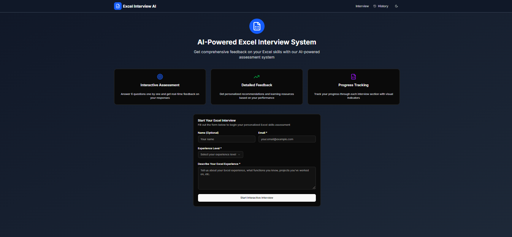
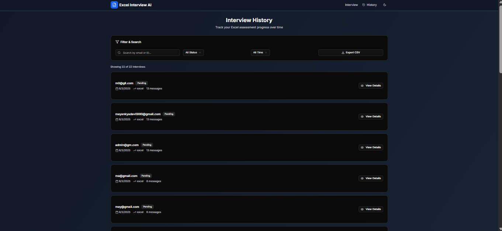

# AI-Powered Excel Interview System

A comprehensive, interactive Excel skills assessment platform that conducts step-by-step interviews using AI, stores Q&A data in MongoDB, and provides detailed evaluation results with human-in-the-loop validation.

## 📸 Screenshots

### Landing Page


*Interactive interview interface with progress tracking and real-time feedback*

### Interview History


*Interview history and results tracking interface*

## 🚀 Features

### Core Functionality
- **Interactive Interview Process**: Step-by-step question and answer flow
- **6-Question Limit**: Structured interview with progress tracking
- **Real-time Evaluation**: AI-powered response assessment
- **MongoDB Storage**: Complete Q&A data persistence
- **Human-in-the-Loop Validation**: Quality control before final results
- **Comprehensive Results**: Detailed breakdown with strengths and improvements

### Technical Stack
- **Backend**: FastAPI with Python
- **Frontend**: Next.js with TypeScript and React
- **AI**: OpenAI GPT-4o-mini with LlamaIndex
- **Database**: MongoDB
- **Workflow**: LlamaIndex workflow integration
- **UI**: Shadcn/ui components

## 📋 Prerequisites

- Python 3.8+
- Node.js 16+
- MongoDB instance
- OpenAI API key

## 🛠️ Installation

### 1. Clone the Repository
```bash
git clone https://github.com/piyushkashyap07/AI-Powered-Excel-Interview-System.git
cd AI-Powered-Excel-Interview-System
```

### 2. Backend Setup
```bash
cd Backend
pip install -r requirements.txt
```

### 3. Frontend Setup
```bash
cd frontend
npm install
```

### 4. Environment Configuration

Create `.env` files in both Backend and frontend directories:

**Backend/.env:**
```env
OPENAI_API_KEY=your_openai_api_key_here
MONGODB_URI=your_mongodb_connection_string
```

**frontend/.env.local:**
```env
NEXT_PUBLIC_API_URL=http://localhost:8000
```

## 🚀 Running the Application

### 1. Start the Backend
```bash
cd Backend
python main.py
```
The backend will run on `http://localhost:8000`

### 2. Start the Frontend
```bash
cd frontend
npm run dev
```
The frontend will run on `http://localhost:3000`

## 🏗️ Project Structure

```
coding-ninjas/
├── Backend/
│   ├── app/
│   │   ├── workflows/
│   │   │   └── Excel_Interview_workflow.py    # Core interview logic
│   │   ├── prompts/                           # AI prompt templates
│   │   ├── models/                           # Pydantic schemas
│   │   ├── routes/                           # FastAPI endpoints
│   │   ├── services/                         # Business logic
│   │   └── helpers/                          # Utility functions
│   ├── main.py                              # FastAPI entry point
│   └── requirements.txt
├── frontend/
│   ├── app/
│   │   └── page.tsx                         # Main interview page
│   ├── components/
│   │   ├── interactive-interview.tsx        # Interview component
│   │   └── interview-results.tsx            # Results display
│   ├── lib/
│   │   └── api.ts                          # API client
│   └── package.json
└── README.md
```

## 🔧 API Endpoints

### Interview Management
- `POST /conversation` - Create new conversation
- `POST /conversation/{id}/start-interactive-interview` - Start interview
- `POST /conversation/{id}/process-interview-step` - Submit response
- `GET /conversation/{id}/interview-state` - Get current state
- `GET /conversations` - List all conversations
- `GET /health` - Health check

## 📊 Interview Flow

### 1. Interview Initialization
- User provides initial information (name, experience level)
- System creates conversation and interview state
- First question is generated based on experience level

### 2. Interactive Q&A Process
- **6 Questions Total**: Intro, Theory, Practical, Advanced (3 variations)
- **Progress Tracking**: Real-time question counter and remaining questions
- **Response Evaluation**: AI evaluates each response with score and feedback
- **Data Storage**: All Q&A pairs stored in MongoDB with timestamps

### 3. Human-in-the-Loop Validation
- **Review Summary**: Comprehensive summary of all Q&A data
- **Human Approval**: Reviewer can approve or reject evaluation
- **Quality Control**: Ensures evaluation quality before final results

### 4. Final Results Generation
- **Comprehensive Analysis**: Uses all stored Q&A data
- **Detailed Breakdown**: Each question, answer, score, and feedback
- **Strengths & Improvements**: Automatic identification of areas
- **Recommendations**: Specific next steps for improvement

## 🗄️ Database Schema

### Conversation Document
```json
{
  "_id": "ObjectId",
  "user_id": "string",
  "created_at": "datetime",
  "interview_state": {
    "conversation_id": "string",
    "current_step": "string",
    "current_question": "number",
    "total_questions": 6,
    "is_complete": "boolean",
    "candidate_info": {
      "name": "string",
      "experience_level": "string"
    },
    "qa_pairs": [
      {
        "step": "string",
        "question": "string",
        "answer": "string",
        "timestamp": "datetime"
      }
    ],
    "evaluations": {
      "step_name": {
        "score": "number",
        "feedback": "string",
        "strengths": ["array"],
        "improvements": ["array"]
      }
    },
    "final_results": {
      "company_name": "string",
      "report_date": "datetime",
      "propensity_score": {
        "score": "number",
        "rationale": "string",
        "visual_indicator": "string"
      },
      "overall_summary": "string"
    },
    "human_approved": "boolean",
    "human_rejected": "boolean",
    "rejection_reason": "string"
  }
}
```

## 🤖 AI Integration

### LlamaIndex Workflow
The system integrates with LlamaIndex workflows for human-in-the-loop validation:

```python
from llama_index.core.workflow import InputRequiredEvent, HumanResponseEvent

async def workflow_human_approval_step(ctx, review_summary: str, conversation_id: str):
    response_event = await ctx.wait_for_event(
        HumanResponseEvent,
        waiter_event=InputRequiredEvent(prefix=question)
    )
    return response_event.response.strip().lower() == "yes"
```

### Prompt Templates
- **Introduction Prompts**: Welcome and experience assessment
- **Theory Prompts**: Excel function and concept questions
- **Practical Prompts**: Real-world scenario questions
- **Advanced Prompts**: Complex Excel features and automation
- **Evaluation Prompts**: Response scoring and feedback

## 🎨 Frontend Features

### Interactive Interview Interface
- **Progress Bar**: Visual progress through 6 questions
- **Question Counter**: "Question X of 6" display
- **Remaining Questions**: "X questions remaining" indicator
- **Markdown Cleaning**: Removes formatting from AI-generated text
- **Real-time Feedback**: Immediate response evaluation display

### Results Display
- **Comprehensive Breakdown**: All Q&A pairs with scores
- **Strengths Analysis**: Areas where candidate performed well
- **Improvement Areas**: Specific areas needing work
- **Recommendations**: Actionable next steps
- **Visual Indicators**: Color-coded performance levels

## 🔒 Security & Validation

### Data Validation
- **Pydantic Models**: Type-safe request/response validation
- **MongoDB ObjectId**: Proper type handling for database queries
- **Error Handling**: Comprehensive error catching and logging

### Human Approval System
- **Review Process**: Complete interview summary for human review
- **Approval/Rejection**: Clear decision points with reasons
- **Fallback Handling**: Graceful error handling when approval fails

## 🧪 Testing

### Backend Testing
```bash
cd Backend
python -m pytest tests/
```

### Frontend Testing
```bash
cd frontend
npm run test
```

## 📈 Performance

### Optimizations
- **Async Operations**: Non-blocking interview processing
- **Database Indexing**: Optimized MongoDB queries
- **Caching**: Interview state caching for faster responses
- **Error Recovery**: Graceful handling of API failures

## 🤝 Contributing

1. Fork the repository
2. Create a feature branch (`git checkout -b feature/amazing-feature`)
3. Commit your changes (`git commit -m 'Add amazing feature'`)
4. Push to the branch (`git push origin feature/amazing-feature`)
5. Open a Pull Request

## 📝 License

This project is licensed under the MIT License - see the [LICENSE](LICENSE) file for details.

## 🆘 Support

For support and questions:
- Create an issue in the repository
- Check the documentation in `/docs`
- Review the API documentation at `http://localhost:8000/docs`

## 🔄 Version History

### v1.0.0
- Initial release with interactive interview system
- MongoDB integration for Q&A storage
- Human-in-the-loop validation
- Comprehensive results generation
- Frontend with progress tracking

## 🎯 Roadmap

- [ ] Multi-language support
- [ ] Advanced analytics dashboard
- [ ] Interview template customization
- [ ] Integration with HR systems
- [ ] Mobile app development
- [ ] Advanced AI evaluation models

---

**Built with ❤️ using FastAPI, Next.js, and OpenAI** 